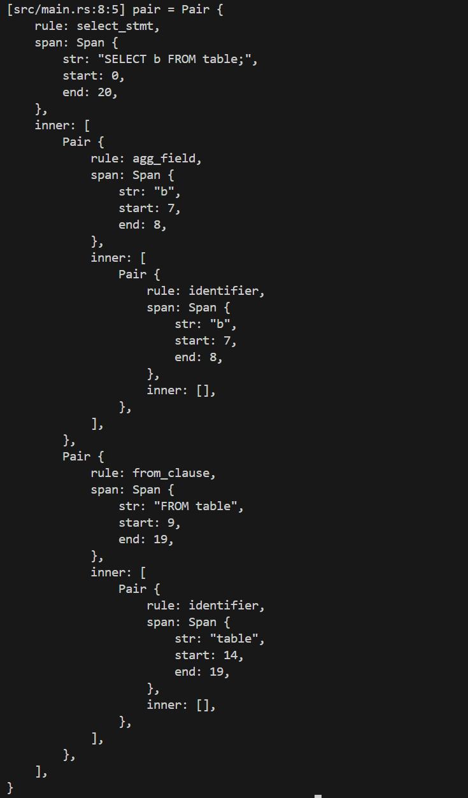

## SQL Query Parser

The `sql_parser` project provides a custom Rust parser for SQL-like queries, implemented using the Pest crate. It can parse SELECT statements with advanced query capabilities, including joins, conditional filtering, aggregate functions, grouping, ordering, and limiting the results.

### Technical Description

The parser processes SQL-like queries by breaking down the input string into a series of tokens, recognizing various syntax elements such as keywords, identifiers (table or column names), operators, and literals (numbers and strings). Each of these elements is mapped to a specific rule in the grammar, which is defined using regular expressions in the pest parser syntax. The grammar specifies how tokens can be combined to form valid SQL-like statements. It is implemented as a set of grammar rules that correspond to different parts of the SQL query, such as `SELECT`, `FROM`, `WHERE`, `JOIN`, `GROUP BY`, `HAVING`, etc.

The parser works by recursively applying these rules to build a parse tree (AST). The tree structure represents the relationships between the components of the query and contains detailed information about selected fields, target tables, filtering conditions, sorting directions etc. After parsing, the AST can be used in various ways, such as further processing and integration with other systems for **query execution**, **data retrieval** and **output formatting** and working with databases in general.

The `sql_parser` processes base SQL-like clauses, specifically:

* **SELECT clause**: Allows selecting fields or using aggregate functions (`COUNT`, `SUM`, `AVG`, `MAX`, `MIN`) on them.
* **FROM and JOIN clauses**: Defines data sources and relationships between them using `JOIN` and `ON` with `=` condition on fields.
* **WHERE clause**: Filters records with conditions on fields, supporting comparison (`=`, `!=`, `<`, `>`, `<=`, `>=`) and logical (`AND`, `OR`) operators.
* **GROUP BY and HAVING clauses**: Enables grouping of results and filtering them with `HAVING` clauses for conditions on fields or aggregate functions.
* **ORDER BY clause**: Orders results based on specified fields, supporting ascending (`ASC`) and descending (`DESC`) sorting.
* **LIMIT clause**: Limits the number of returned results.

### Example

**SQL Query:**

``` sql
SELECT b FROM table;
```

**AST tree:**

